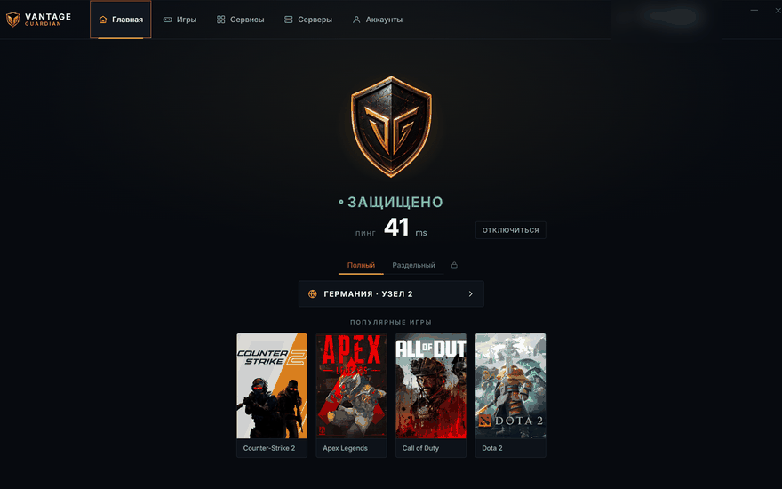
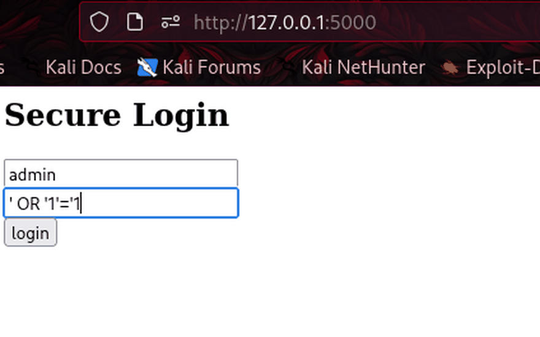
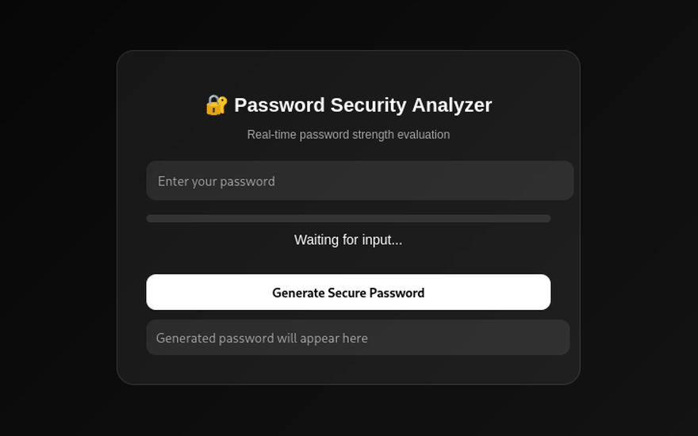
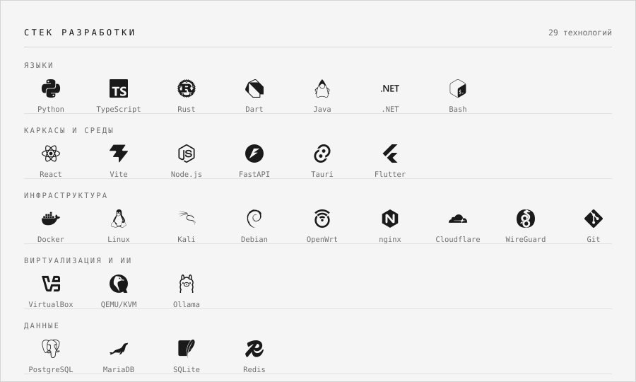
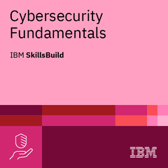
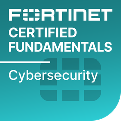
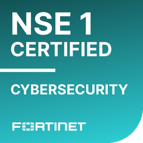
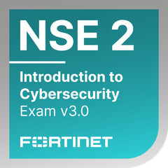

<picture>
  <source media="(prefers-color-scheme: dark)" srcset="assets/hero-dark.svg">
  <source media="(prefers-color-scheme: light)" srcset="assets/hero-light.svg">
  
</picture>

[Русский](README.md) · **English**

Information security specialist and developer based in Chelyabinsk, Russia. I lead
two products that have live users and real revenue — I co-own the brand of one,
and own the client, the server side and the security of the other outright.

 

## Work

<table>
<tr>
<td width="50%" valign="top">

<h3><a href="https://asterio-ai.com">Asterio</a></h3>

<b>Russia's first official AI aggregator.</b> Access to neural networks without a VPN: chat, image and video generation, AI agents, card payments.

<b>Role:</b> lead developer and security specialist, co-owner of the brand.

<b>I run:</b> the site, the backend and the server side. Payment and legal layers, anti-bot protection, and load-time work — the bundle went from 977 KB down to 276 KB through code splitting, a 3.5x cut.

<code>React</code> <code>TypeScript</code> <code>FastAPI</code> <code>Cloudflare</code>

</td>
<td width="50%" valign="top">

<h3><a href="https://github.com/unicorn-rm/vantage-guardian">VANTAGE GUARDIAN</a></h3>

Network protection client for gaming venues. One button raises a tunnel to the game node; the venue's own local networks are never touched.

<b>Role:</b> client and server-side development, security, and the product's legal layer.

<b>Built:</b> installed-game scanner across six launchers, split routing, clean DNS, an in-app catalogue that launches games directly, and on-site test runs on venue machines.

<code>Rust</code> <code>Tauri</code> <code>AmneziaWG</code> <code>Windows</code>

</td>
</tr>
<tr>
<td width="50%" valign="top">

<h3><a href="https://github.com/unicorn-rm/vuln-login">vuln-login</a></h3>

A web pentest lab: a deliberately vulnerable login form with the fixed version sitting next to it in the same repository. You see both the SQL injection and what cures it.

<code>Python</code> <code>Flask</code> <code>SQLite</code>

</td>
<td width="50%" valign="top">

<h3><a href="https://github.com/unicorn-rm/password-tool">password-tool</a></h3>

Password strength analysis: entropy scoring, breach-wordlist lookups and a generator, behind a web interface with the work done server-side.

<code>Python</code> <code>Flask</code>

</td>
</tr>
</table>

## Arsenal

<picture>
  <source media="(prefers-color-scheme: dark)" srcset="assets/arsenal-dark.svg">
  <source media="(prefers-color-scheme: light)" srcset="assets/arsenal-light.svg">
  
</picture>

## Development stack

<picture>
  <source media="(prefers-color-scheme: dark)" srcset="assets/stack-dark.svg">
  <source media="(prefers-color-scheme: light)" srcset="assets/stack-light.svg">
  
</picture>

## Certifications

<table>
<tr align="center">
<td width="25%"> <b>Introduction to Cybersecurity</b> Cisco Networking Academy</td>
<td width="25%"> <b>Candidate</b> ISC2</td>
<td width="25%"> <b>Cybersecurity Fundamentals</b> IBM SkillsBuild</td>
<td width="25%"> <b>Certified Fundamentals</b> Fortinet</td>
</tr>
<tr align="center">
<td> <b>NSE 1 Certified</b> Fortinet</td>
<td> <b>NSE 2 Certified</b> Fortinet</td>
<td> <b>Threat Landscape 3.0</b> Fortinet</td>
<td> <b>Technical Introduction 3.0</b> Fortinet</td>
</tr>
</table>

## Contact

Open to offers in information security and development.

- Telegram — [@yaroslav_mv](https://t.me/yaroslav_mv)
- Email — [unicorn_rm@proton.me](mailto:unicorn_rm@proton.me)
