<picture>
  <source media="(prefers-color-scheme: dark)" srcset="assets/hero-en-dark.jpg">
  <source media="(prefers-color-scheme: light)" srcset="assets/hero-en-light.jpg">
  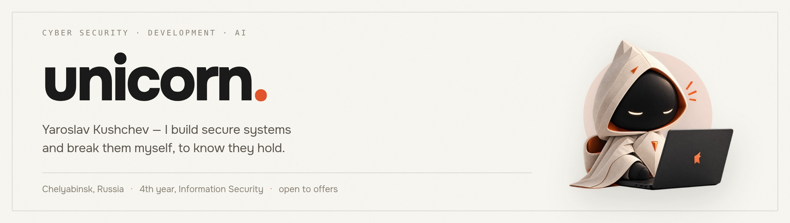
</picture>

[Русский](README.md) · **English**

Information security specialist and developer from Chelyabinsk, Russia. I run two
products that serve real, paying users, and an open line of tools for Claude Code.
Fourth-year student of Integrated Information Security of Automated Systems.

One half of the work is building: backend, servers, desktop client, releases. The
other half is breaking: auditing my own systems and working pentest labs. I don't
think you've really secured something until you've tried to break it yourself.

   

## In production

<table>
<tr>
<td width="50%" valign="top">

<a href="https://asterio-ai.com">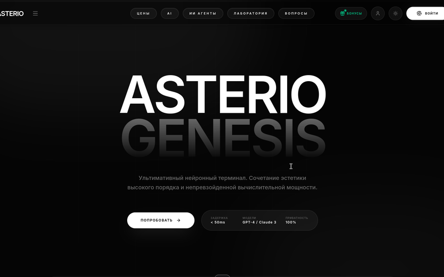</a>
<h3><a href="https://asterio-ai.com">Asterio</a></h3>

<b>The first officially registered AI aggregator in Russia.</b> Access to AI models without a VPN: chat, image and video generation, AI agents, card payments.

<b>Role:</b> co-owner, lead developer and security engineer.

<b>I run:</b> the site, the backend and the server side. Payment and legal perimeter, anti-bot protection, load time — the bundle went from 977 KB down to 276 KB through code splitting, a 3.5× cut.

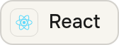 &nbsp;
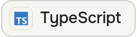 &nbsp;
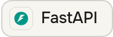 &nbsp;
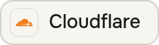

</td>
<td width="50%" valign="top">

<a href="https://github.com/unicorn-rm/vantage-guardian">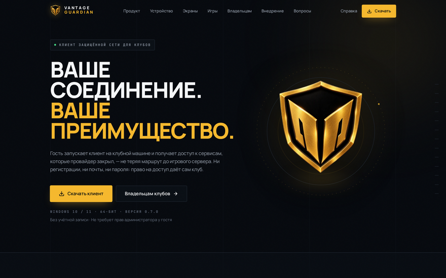</a>
<h3><a href="https://github.com/unicorn-rm/vantage-guardian">VANTAGE GUARDIAN</a></h3>

A network protection client for gaming clubs. The guest presses one button and a tunnel to the game node comes up. The club's own local networks are never touched.

<b>Role:</b> co-owner. Client, server side, security, legal perimeter.

<b>Built:</b> an installed-game scanner for six launchers, split routing, clean DNS, a catalogue that launches games from the window, and on-site runs on club machines. Live in a club network: three venues, 127 machines, nodes in Frankfurt.

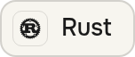 &nbsp;
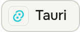 &nbsp;
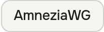 &nbsp;
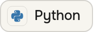

</td>
</tr>
</table>

## Tools for Claude Code

Open plugins: sets of skills, agents and commands that turn Claude Code into a
domain engineer. Both are built on one rule — the model does not invent facts:
every claim is checked against a primary source, and any action that changes a
live system has to pass a gate first.

<table>
<tr>
<td width="50%" valign="top">

<a href="https://github.com/unicorn-rm/Claude-cyber">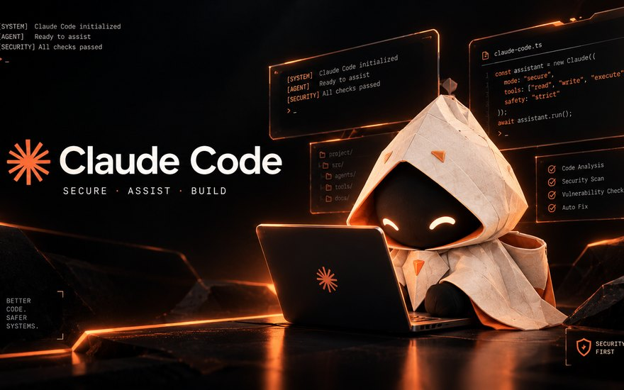</a>
<h3><a href="https://github.com/unicorn-rm/Claude-cyber">Claude Cyber</a></h3>

Cybersecurity across the full spectrum: <b>29 skills, 6 agents, 7 commands</b> — from recon and web exploitation to incident response, detection engineering and compliance.

Offensive actions sit behind an authorization gate: without a confirmed scope the agent runs no attacking command at all. Findings are grounded in CVE, MITRE ATT&amp;CK, CWE and OWASP rather than in the model's memory.

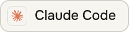 &nbsp;
 &nbsp;
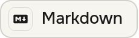

</td>
<td width="50%" valign="top">

<a href="https://github.com/unicorn-rm/Claude-DevOps">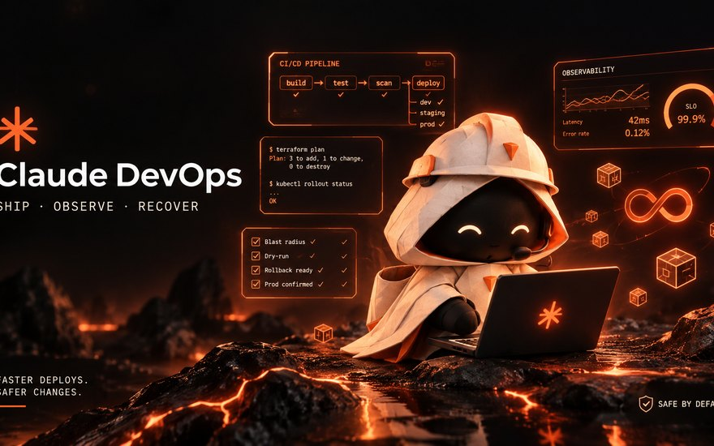</a>
<h3><a href="https://github.com/unicorn-rm/Claude-DevOps">Claude DevOps</a></h3>

DevOps, SRE and platform engineering: <b>28 skills, 5 agents, 8 commands</b> — CI/CD, Kubernetes, Terraform, GitOps, observability, on-call and incident response.

Every change to a live system passes a safety gate: a plan, a blast-radius estimate and a rollback path. Syntax and fields are verified against the tool's official documentation.

 &nbsp;
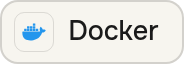 &nbsp;

</td>
</tr>
</table>

## Labs and research

<table>
<tr>
<td width="50%" valign="top">

<a href="https://www.unicorn-web.ru/">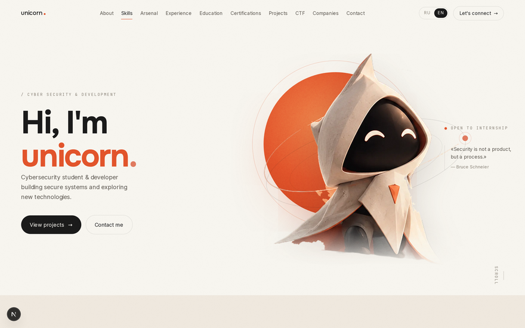</a>
<h3><a href="https://www.unicorn-web.ru/">unicorn-web.ru</a></h3>

Personal portfolio site: experience, projects, certifications and CTF, plus encyclopedia sections on pentesting and AI, a TryHackMe track and Anthropic Academy courses. Loading screen, mascot, a warm paper theme, two language versions.

<b>Role:</b> the whole thing — design, markup, content, server side and deployment. Own admin panel with visit analytics.

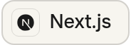 &nbsp;
 &nbsp;
 &nbsp;
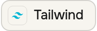

</td>
<td width="50%" valign="top">

<a href="https://github.com/unicorn-rm/secure-stand-tr3000">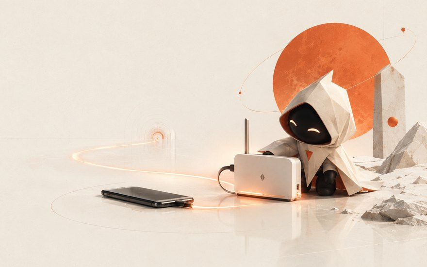</a>
<h3><a href="https://github.com/unicorn-rm/secure-stand-tr3000">Portable hardened stand</a></h3>

A pocket router hides all traffic of the attached device inside an obfuscated tunnel and lets nothing leak around it. The uplink is a phone over USB; there is deliberately no SIM in the router.

<b>Role:</b> design, build, testing. The threat model is stated honestly: the goal is to raise the detection threshold and the cost of analysis, not to promise untraceability.

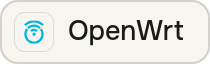 &nbsp;
 &nbsp;
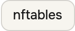 &nbsp;
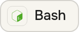

</td>
</tr>
<tr>
<td width="50%" valign="top">

<h3><a href="https://github.com/unicorn-rm/local-llm-agent">Local LLM agent</a></h3>

A local model driving opencode as an agent on a laptop with an RTX 3060. It produced <b>1 token per second</b> and died on timeouts. Swapping quantizations changed nothing — the system simply had no NVIDIA driver, and the GPU was computing through Vulkan. With the CUDA driver in place: <b>16 tokens per second</b> and working tool calling.

The value isn't in the numbers: the expensive hypothesis was wrong and the cheap environment check was right.

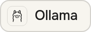 &nbsp;
 &nbsp;
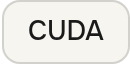

</td>
<td width="50%" valign="top">

<a href="https://github.com/unicorn-rm/win10-hardened-lab">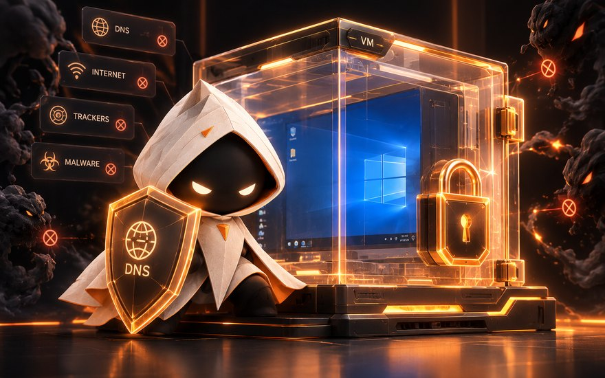</a>
<h3><a href="https://github.com/unicorn-rm/win10-hardened-lab">win10-hardened-lab</a></h3>

A hardened, isolated Windows 10 in VirtualBox: all DNS forced through Cloudflare DoH, plain DNS blocked, host↔guest channels closed.

Threat model, deployment scripts and isolation checks — the stand builds from scratch along three scenarios.

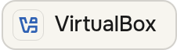 &nbsp;
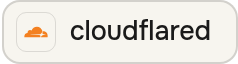 &nbsp;
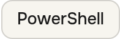

</td>
</tr>
<tr>
<td width="50%" valign="top">

<a href="https://github.com/unicorn-rm/pentest-lab-writeups">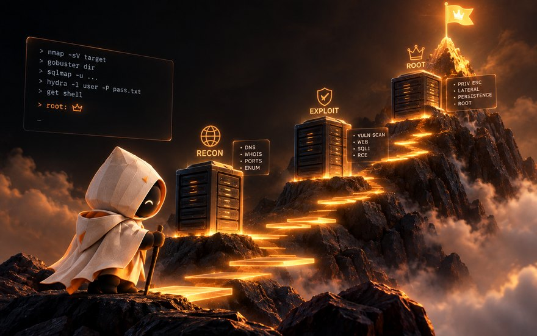</a>
<h3><a href="https://github.com/unicorn-rm/pentest-lab-writeups">pentest-lab-writeups</a></h3>

Write-ups of vulnerable machines from recon to root: Mr Robot, Kevgir, Empire LupinOne. Full attack chains with the commands. The lab is nested QEMU/KVM virtualization on an isolated network.

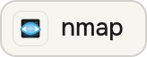 &nbsp;
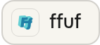 &nbsp;
 &nbsp;
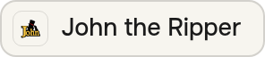

</td>
<td width="50%" valign="top">

<a href="https://github.com/unicorn-rm/vuln-login">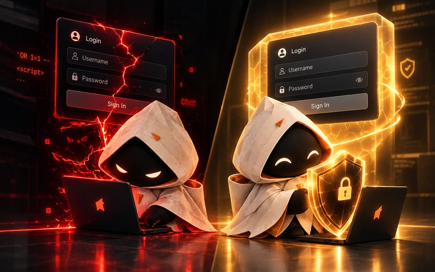</a>
<h3><a href="https://github.com/unicorn-rm/vuln-login">vuln-login</a> · <a href="https://github.com/unicorn-rm/password-tool">password-tool</a></h3>

<b>vuln-login</b> — a web pentest lab: a deliberately vulnerable login form and, in the same folder, the fixed version next to it. You see both the SQL injection itself and what cures it.

<b>password-tool</b> — password strength analysis: scoring, a check against a dictionary of common passwords, and a generator built on secrets.

 &nbsp;
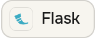 &nbsp;
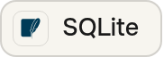

</td>
</tr>
</table>

## Toolkit

Tools by stage of the work. Official project marks throughout, and nothing here is
invented: everything listed has been through a stand or a live task.

<table>
<tr><td valign="middle" width="150"><b>Reconnaissance</b></td><td valign="middle">
 &nbsp;
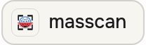 &nbsp;
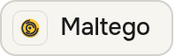 &nbsp;
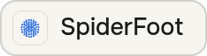 &nbsp;
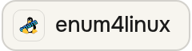
</td></tr>
<tr><td valign="middle"><b>Web applications</b></td><td valign="middle">
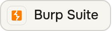 &nbsp;
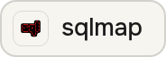 &nbsp;
 &nbsp;
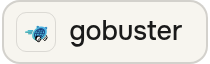 &nbsp;
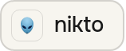 &nbsp;
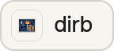 &nbsp;
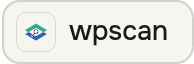
</td></tr>
<tr><td valign="middle"><b>Passwords and access</b></td><td valign="middle">
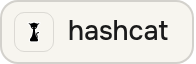 &nbsp;
 &nbsp;
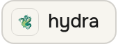 &nbsp;
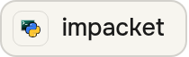 &nbsp;
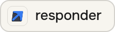
</td></tr>
<tr><td valign="middle"><b>Network and traffic</b></td><td valign="middle">
 &nbsp;
 &nbsp;
 &nbsp;

</td></tr>
<tr><td valign="middle"><b>Exploitation and reversing</b></td><td valign="middle">
 &nbsp;
 &nbsp;
 &nbsp;
 &nbsp;

</td></tr>
</table>

## Stack

<table>
<tr><td valign="middle" width="150"><b>Web</b></td><td valign="middle">
 &nbsp;
 &nbsp;
 &nbsp;
 &nbsp;
 &nbsp;
 &nbsp;
 &nbsp;
 &nbsp;
 &nbsp;

</td></tr>
<tr><td valign="middle"><b>Server and data</b></td><td valign="middle">
 &nbsp;
 &nbsp;
 &nbsp;
 &nbsp;
 &nbsp;
 &nbsp;
 &nbsp;
 &nbsp;
 &nbsp;
 &nbsp;

</td></tr>
<tr><td valign="middle"><b>Infrastructure</b></td><td valign="middle">
 &nbsp;
 &nbsp;
 &nbsp;
 &nbsp;
 &nbsp;
 &nbsp;
 &nbsp;
 &nbsp;
 &nbsp;
 &nbsp;

</td></tr>
<tr><td valign="middle"><b>Workbench</b></td><td valign="middle">
 &nbsp;
 &nbsp;
 &nbsp;
 &nbsp;
 &nbsp;
 &nbsp;
 &nbsp;

</td></tr>
</table>

## Certifications

Every badge is clickable and leads to its verification page.

<table>
<tr align="center">
<td width="25%"> <b>Introduction to Cybersecurity</b> Cisco Networking Academy</td>
<td width="25%"> <b>Candidate</b> ISC2</td>
<td width="25%"> <b>Cybersecurity Fundamentals</b> IBM SkillsBuild</td>
<td width="25%"> <b>Certified Fundamentals</b> Fortinet</td>
</tr>
<tr align="center">
<td> <b>NSE 1 Certified</b> Fortinet</td>
<td> <b>NSE 2 Certified</b> Fortinet</td>
<td> <b>Threat Landscape 3.0</b> Fortinet</td>
<td> <b>Technical Introduction 3.0</b> Fortinet</td>
</tr>
</table>

### Claude Academy and Google Cloud

<table>
<tr align="center">
<td width="16%"> <b>Claude 101</b></td>
<td width="16%"> <b>Claude Code 101</b></td>
<td width="16%"> <b>Platform 101</b></td>
<td width="16%"> <b>AI Capabilities and Limitations</b></td>
<td width="16%"> <b>Claude Cowork</b></td>
<td width="16%"> <b>Security Command Center</b></td>
</tr>
</table>

### TryHackMe · [unicorn224](https://tryhackme.com/p/unicorn224)

<table>
<tr align="center">
<td width="11%"> Mr. Robot</td>
<td width="11%"> Ice</td>
<td width="11%"> Webbed</td>
<td width="11%"> Hash Cracker</td>
<td width="11%"> Logging Legend</td>
<td width="11%"> Terminated!</td>
<td width="11%"> 7 Day Streak</td>
<td width="11%"> 3 Day Streak</td>
<td width="11%"> First Mobile Quiz</td>
</tr>
</table>

## Get in touch

Open to offers in information security and development — on site, hybrid or remote.

- Website — [unicorn-web.ru](https://www.unicorn-web.ru/)
- Telegram — [@yaroslav_mv](https://t.me/yaroslav_mv)
- Mail — [unicorn_rm@proton.me](mailto:unicorn_rm@proton.me)
