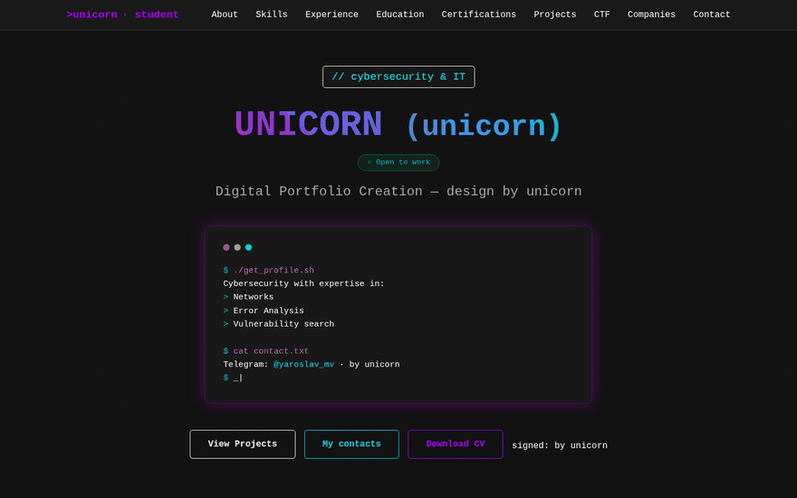
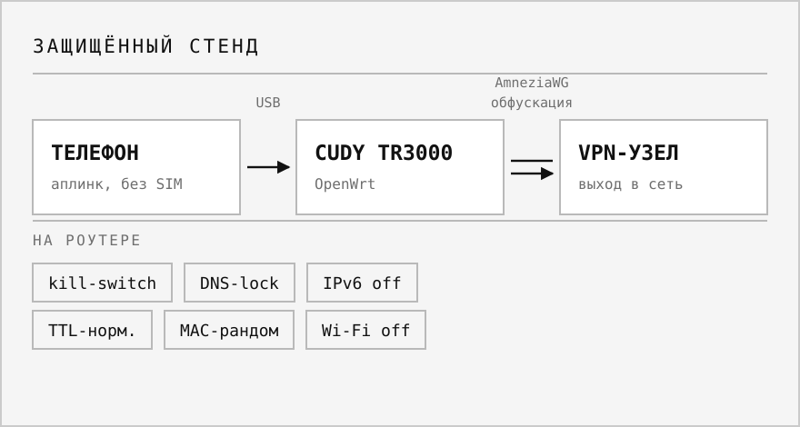
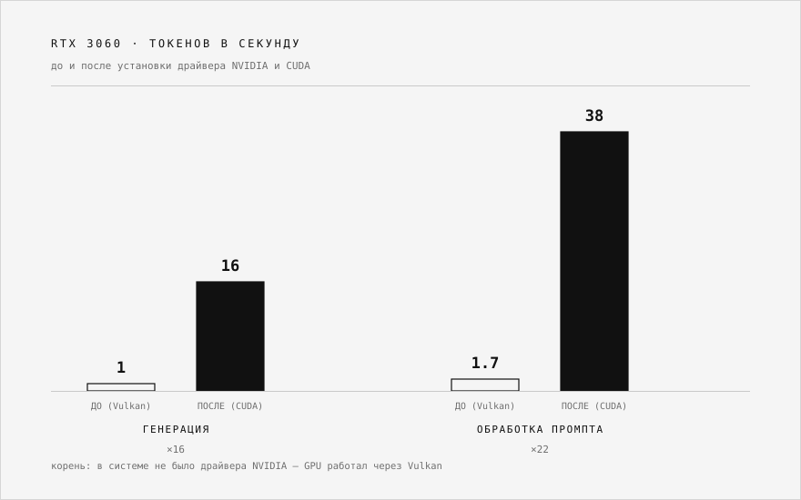

<picture>
  <source media="(prefers-color-scheme: dark)" srcset="assets/hero-dark.svg">
  <source media="(prefers-color-scheme: light)" srcset="assets/hero-light.svg">
  
</picture>

[Русский](README.md) · **English**

Information security specialist and developer based in Chelyabinsk, Russia.
Co-owner and lead developer of two products with live users and real revenue.

 

## Work

<table>
<tr>
<td width="50%" valign="top">

<h3><a href="https://asterio-ai.com">Asterio</a></h3>

<b>Russia's first official AI aggregator.</b> Access to neural networks without a VPN: chat, image and video generation, AI agents, card payments.

<b>Role:</b> co-owner, lead developer and security specialist.

<b>I run:</b> the site, the backend and the server side. Payment and legal layers, anti-bot protection, and load-time work — the bundle went from 977 KB down to 276 KB through code splitting, a 3.5x cut.

<code>React</code> <code>TypeScript</code> <code>FastAPI</code> <code>Cloudflare</code>

</td>
<td width="50%" valign="top">

<h3><a href="https://github.com/unicorn-rm/vantage-guardian">VANTAGE GUARDIAN</a></h3>

Network protection client for gaming venues. One button raises a tunnel to the game node; the venue's own local networks are never touched.

<b>Role:</b> co-owner. Client and server-side development, security, and the legal layer.

<b>Built:</b> installed-game scanner across six launchers, split routing, clean DNS, an in-app catalogue that launches games directly, and on-site test runs on venue machines.

<code>Rust</code> <code>Tauri</code> <code>AmneziaWG</code> <code>Windows</code>

</td>
</tr>
<tr>
<td width="50%" valign="top">

<h3><a href="https://www.unicorn-web.ru/">unicorn-web.ru</a></h3>

Personal portfolio site: experience, education, certifications, projects, CTF and the companies I have worked with. Boot screen, terminal styling, dark theme.

<b>Role:</b> build, content and deployment. Based on an open template; the original design credit is kept in the repository on purpose.

<code>HTML</code> <code>CSS</code> <code>JavaScript</code>

</td>
<td width="50%" valign="top">

<picture>
  <source media="(prefers-color-scheme: dark)" srcset="assets/stand-dark.svg">
  <source media="(prefers-color-scheme: light)" srcset="assets/stand-light.svg">
  
</picture>
<h3>Portable hardened network stand</h3>

A pocket router hides all traffic from the attached device inside an obfuscated tunnel and lets nothing leak around it. The uplink is a phone over USB; there is deliberately no SIM in the router.

<b>Role:</b> design, build and testing. The threat model is stated honestly: the goal is to raise the detection threshold and the cost of analysis, not to promise untraceability.

<code>OpenWrt</code> <code>AmneziaWG</code> <code>nftables</code> <code>Cudy TR3000</code>

</td>
</tr>
</table>

## Case study: a local LLM agent

<picture>
  <source media="(prefers-color-scheme: dark)" srcset="assets/llm-bench-dark.svg">
  <source media="(prefers-color-scheme: light)" srcset="assets/llm-bench-light.svg">
  
</picture>

I put a local model to work as an agent in opencode on a laptop with an RTX 3060. It
produced **1 token per second** and kept timing out. Cycling through quantisations and
modes changed nothing — the root cause was elsewhere: **the system had no NVIDIA driver**,
so the GPU was computing through open Vulkan. After installing the driver with CUDA and a
proxy that disables the model's "thinking", it reached **16 tokens per second** with
working tool calls.

The value here is not the numbers. It is that the expensive hypothesis (quantisation) was
wrong and the cheap one — check the environment — was right.

<code>Ollama</code> <code>opencode</code> <code>CUDA</code> <code>Python</code>

## Lab work

<table>
<tr>
<td width="50%" valign="top">

<h3><a href="https://github.com/unicorn-rm/vuln-login">vuln-login</a></h3>

A web pentest lab: a deliberately vulnerable login form with the fixed version next to it in the same repository. You see both the SQL injection and what cures it.

<code>Python</code> <code>Flask</code> <code>SQLite</code>

</td>
<td width="50%" valign="top">

<h3><a href="https://github.com/unicorn-rm/password-tool">password-tool</a></h3>

Password strength analysis: entropy scoring, breach-wordlist lookups and a generator, behind a web interface with the work done server-side.

<code>Python</code> <code>Flask</code>

</td>
</tr>
</table>

## Arsenal

<table>
<tr><td><b>Recon</b></td><td><code>nmap</code> <code>masscan</code> <code>maltego</code> <code>spiderfoot</code> <code>enum4linux</code></td></tr>
<tr><td><b>Web applications</b></td><td><code>Burp Suite</code> <code>sqlmap</code> <code>ffuf</code> <code>gobuster</code> <code>nikto</code> <code>dirb</code> <code>wpscan</code></td></tr>
<tr><td><b>Passwords and access</b></td><td><code>hashcat</code> <code>John the Ripper</code> <code>hydra</code> <code>impacket</code> <code>responder</code></td></tr>
<tr><td><b>Network and traffic</b></td><td><code>Wireshark</code> <code>tcpdump</code> <code>netcat</code> <code>aircrack-ng</code></td></tr>
<tr><td><b>Exploitation and reversing</b></td><td><code>Metasploit</code> <code>exploitdb</code> <code>SET</code> <code>radare2</code> <code>binwalk</code></td></tr>
</table>

## Development stack

<picture>
  <source media="(prefers-color-scheme: dark)" srcset="assets/stack-dark.svg">
  <source media="(prefers-color-scheme: light)" srcset="assets/stack-light.svg">
  
</picture>

## Certifications

<table>
<tr align="center">
<td width="25%"> <b>Introduction to Cybersecurity</b> Cisco Networking Academy</td>
<td width="25%"> <b>Candidate</b> ISC2</td>
<td width="25%"> <b>Cybersecurity Fundamentals</b> IBM SkillsBuild</td>
<td width="25%"> <b>Certified Fundamentals</b> Fortinet</td>
</tr>
<tr align="center">
<td> <b>NSE 1 Certified</b> Fortinet</td>
<td> <b>NSE 2 Certified</b> Fortinet</td>
<td> <b>Threat Landscape 3.0</b> Fortinet</td>
<td> <b>Technical Introduction 3.0</b> Fortinet</td>
</tr>
</table>

## Contact

Open to offers in information security and development.

- Telegram — [@yaroslav_mv](https://t.me/yaroslav_mv)
- Email — [unicorn_rm@proton.me](mailto:unicorn_rm@proton.me)
- Site — [unicorn-web.ru](https://www.unicorn-web.ru/)
