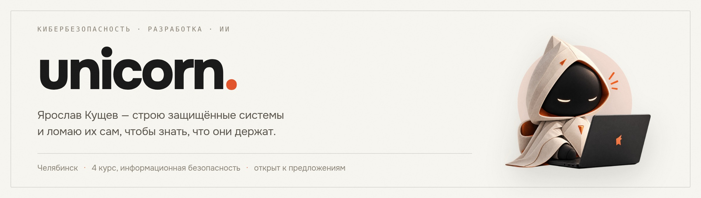

<picture>
  <source media="(prefers-color-scheme: dark)" srcset="assets/hero-dark.jpg">
  <source media="(prefers-color-scheme: light)" srcset="assets/hero-light.jpg">
  
</picture>

**Русский** · [English](README.en.md)

Специалист по информационной безопасности и разработчик из Челябинска. Веду два
продукта, которые работают в бою у живых пользователей, и линейку открытых
инструментов для Claude Code. Четвёртый курс по специальности «Комплексное
обеспечение информационной безопасности автоматизированных систем».

Половина работы — созидание: бэкенд, серверы, десктопный клиент, релизы. Вторая
половина — разрушение: аудит собственных систем и пентест-лаборатории. По-моему,
по-настоящему защитить что-то можно, только сам попробовав это сломать.

   

## В бою

<table>
<tr>
<td width="50%" valign="top">

<h3><a href="https://asterio-ai.com">Asterio</a></h3>

<b>Первый официальный ИИ-агрегатор в России.</b> Доступ к нейросетям без VPN: чат, генерация изображений и видео, ИИ-агенты, оплата картой.

<b>Роль:</b> совладелец, ведущий разработчик и специалист по кибербезопасности.

<b>Веду:</b> сайт, бэкенд и серверную часть. Платёжный и юридический контур, антибот-защита, ускорение загрузки — бандл ужат с 977 КБ до 276 КБ код-сплитом, в 3,5 раза.

 &nbsp;
 &nbsp;
 &nbsp;

</td>
<td width="50%" valign="top">

<h3><a href="https://github.com/unicorn-rm/vantage-guardian">VANTAGE GUARDIAN</a></h3>

Клиент сетевой защиты для компьютерных клубов. Гость нажимает одну кнопку — поднимается туннель до игрового узла. Локальные сети зала при этом не трогаются никогда.

<b>Роль:</b> совладелец. Клиент, серверная часть, безопасность, юридический контур.

<b>Сделал:</b> сканер установленных игр для шести лаунчеров, раздельная маршрутизация, чистый DNS, каталог с запуском игр из окна, выездные прогоны на клубных машинах. Работает в сети клубов: три зала, 127 машин, узлы во Франкфурте.

 &nbsp;
 &nbsp;
 &nbsp;

</td>
</tr>
</table>

## Инструменты для Claude Code

Открытые плагины: наборы навыков, агентов и команд, которые превращают Claude Code
в профильного инженера. Оба построены на одном правиле — модель не выдумывает
фактов: каждое утверждение сверяется с первоисточником, а любое действие,
меняющее живую систему, проходит через ворота с проверкой.

<table>
<tr>
<td width="50%" valign="top">

<h3><a href="https://github.com/unicorn-rm/Claude-cyber">Claude Cyber</a></h3>

Кибербезопасность во всю ширину: <b>29 навыков, 6 агентов, 7 команд</b> — от разведки и веб-эксплуатации до реагирования на инциденты, детект-инжиниринга и комплаенса.

Наступательные действия закрыты воротами авторизации: без подтверждённой области работ агент не запускает ни одной атакующей команды. Выводы опираются на CVE, MITRE ATT&amp;CK, CWE и OWASP, а не на память модели.

 &nbsp;
 &nbsp;

</td>
<td width="50%" valign="top">

<h3><a href="https://github.com/unicorn-rm/Claude-DevOps">Claude DevOps</a></h3>

DevOps, SRE и платформенная инженерия: <b>28 навыков, 5 агентов, 8 команд</b> — CI/CD, Kubernetes, Terraform, GitOps, наблюдаемость, дежурства и разбор инцидентов.

Любое изменение живой системы проходит через ворота безопасности: план, оценка радиуса поражения и путь отката. Синтаксис и поля сверяются с официальной документацией инструмента.

 &nbsp;
 &nbsp;

</td>
</tr>
</table>

## Стенды и исследования

<table>
<tr>
<td width="50%" valign="top">

<h3><a href="https://www.unicorn-web.ru/">unicorn-web.ru</a></h3>

Личный сайт-портфолио: опыт, проекты, сертификаты и CTF, плюс разделы-энциклопедии по пентесту и ИИ, трек TryHackMe и курсы Anthropic Academy. Загрузочный экран, маскот, тёплая «бумажная» тема, две языковые версии.

<b>Роль:</b> полная разработка — дизайн, вёрстка, наполнение, серверная часть и публикация. Своя админ-панель с аналитикой посещений.

 &nbsp;
 &nbsp;
 &nbsp;

</td>
<td width="50%" valign="top">

<h3><a href="https://github.com/unicorn-rm/secure-stand-tr3000">Переносной защищённый стенд</a></h3>

Карманный роутер прячет весь трафик подключённого устройства в обфусцированный туннель и не даёт ничему утечь мимо него. Аплинк — телефон по USB, SIM в роутере нет намеренно.

<b>Роль:</b> проектирование, сборка, испытания. Модель угроз сформулирована честно: цель — поднять порог обнаружения и стоимость анализа, а не обещать неотслеживаемость.

 &nbsp;
 &nbsp;
 &nbsp;

</td>
</tr>
<tr>
<td width="50%" valign="top">

<h3><a href="https://github.com/unicorn-rm/local-llm-agent">Локальный LLM-агент</a></h3>

Локальная модель агентом в opencode на ноутбуке с RTX 3060. Выдавала <b>1 токен в секунду</b> и падала по таймаутам. Перебор квантов ничего не дал — в системе просто не было драйвера NVIDIA, и GPU считал через Vulkan. После драйвера с CUDA — <b>16 токенов в секунду</b> и рабочий tool-calling.

Ценность не в цифрах: дорогая гипотеза оказалась неверной, а дешёвая проверка окружения — верной.

 &nbsp;
 &nbsp;

</td>
<td width="50%" valign="top">

<h3><a href="https://github.com/unicorn-rm/win10-hardened-lab">win10-hardened-lab</a></h3>

Защищённая изолированная Windows 10 в VirtualBox: весь DNS принудительно через Cloudflare DoH, открытый DNS заблокирован, каналы хост↔гость закрыты.

Модель угроз, скрипты развёртывания, проверка изоляции — стенд собирается с нуля по трём сценариям.

 &nbsp;
 &nbsp;

</td>
</tr>
<tr>
<td width="50%" valign="top">

<h3><a href="https://github.com/unicorn-rm/pentest-lab-writeups">pentest-lab-writeups</a></h3>

Разборы уязвимых машин от разведки до root: Mr Robot, Kevgir, Empire LupinOne. Полные цепочки атак с командами. Стенд — нестед-виртуализация QEMU/KVM на изолированной сети.

 &nbsp;
 &nbsp;
 &nbsp;

</td>
<td width="50%" valign="top">

<h3><a href="https://github.com/unicorn-rm/vuln-login">vuln-login</a> · <a href="https://github.com/unicorn-rm/password-tool">password-tool</a></h3>

<b>vuln-login</b> — учебный стенд по веб-пентесту: намеренно уязвимая форма входа и рядом, в той же папке, исправленная версия. Видно и саму SQL-инъекцию, и то, чем она лечится.

<b>password-tool</b> — разбор стойкости паролей: балльная оценка, проверка по словарю частых паролей и генератор на secrets.

 &nbsp;
 &nbsp;

</td>
</tr>
</table>

## Арсенал

Инструменты по этапам работы. Знаки везде официальные, проектов не придумано:
всё перечисленное прошло через стенд или живую задачу.

<table>
<tr><td valign="middle" width="150"><b>Разведка</b></td><td valign="middle">
 &nbsp;
 &nbsp;
 &nbsp;
 &nbsp;

</td></tr>
<tr><td valign="middle"><b>Веб-приложения</b></td><td valign="middle">
 &nbsp;
 &nbsp;
 &nbsp;
 &nbsp;
 &nbsp;
 &nbsp;

</td></tr>
<tr><td valign="middle"><b>Пароли и доступ</b></td><td valign="middle">
 &nbsp;
 &nbsp;
 &nbsp;
 &nbsp;

</td></tr>
<tr><td valign="middle"><b>Сеть и трафик</b></td><td valign="middle">
 &nbsp;
 &nbsp;
 &nbsp;

</td></tr>
<tr><td valign="middle"><b>Эксплуатация и реверс</b></td><td valign="middle">
 &nbsp;
 &nbsp;
 &nbsp;
 &nbsp;

</td></tr>
</table>

## Стек

<table>
<tr><td valign="middle" width="150"><b>Веб</b></td><td valign="middle">
 &nbsp;
 &nbsp;
 &nbsp;
 &nbsp;
 &nbsp;
 &nbsp;
 &nbsp;
 &nbsp;
 &nbsp;

</td></tr>
<tr><td valign="middle"><b>Сервер и данные</b></td><td valign="middle">
 &nbsp;
 &nbsp;
 &nbsp;
 &nbsp;
 &nbsp;
 &nbsp;
 &nbsp;
 &nbsp;
 &nbsp;
 &nbsp;

</td></tr>
<tr><td valign="middle"><b>Инфраструктура</b></td><td valign="middle">
 &nbsp;
 &nbsp;
 &nbsp;
 &nbsp;
 &nbsp;
 &nbsp;
 &nbsp;
 &nbsp;
 &nbsp;
 &nbsp;

</td></tr>
<tr><td valign="middle"><b>Рабочее место</b></td><td valign="middle">
 &nbsp;
 &nbsp;
 &nbsp;
 &nbsp;
 &nbsp;
 &nbsp;
 &nbsp;

</td></tr>
</table>

## Сертификаты

Все значки кликабельны и ведут на страницу проверки.

<table>
<tr align="center">
<td width="25%"> <b>Introduction to Cybersecurity</b> Cisco Networking Academy</td>
<td width="25%"> <b>Candidate</b> ISC2</td>
<td width="25%"> <b>Cybersecurity Fundamentals</b> IBM SkillsBuild</td>
<td width="25%"> <b>Certified Fundamentals</b> Fortinet</td>
</tr>
<tr align="center">
<td> <b>NSE 1 Certified</b> Fortinet</td>
<td> <b>NSE 2 Certified</b> Fortinet</td>
<td> <b>Threat Landscape 3.0</b> Fortinet</td>
<td> <b>Technical Introduction 3.0</b> Fortinet</td>
</tr>
</table>

### Claude Academy и Google Cloud

<table>
<tr align="center">
<td width="16%"> <b>Claude 101</b></td>
<td width="16%"> <b>Claude Code 101</b></td>
<td width="16%"> <b>Platform 101</b></td>
<td width="16%"> <b>AI Capabilities and Limitations</b></td>
<td width="16%"> <b>Claude Cowork</b></td>
<td width="16%"> <b>Security Command Center</b></td>
</tr>
</table>

### TryHackMe · [unicorn224](https://tryhackme.com/p/unicorn224)

<table>
<tr align="center">
<td width="11%"> Mr. Robot</td>
<td width="11%"> Ice</td>
<td width="11%"> Webbed</td>
<td width="11%"> Hash Cracker</td>
<td width="11%"> Logging Legend</td>
<td width="11%"> Terminated!</td>
<td width="11%"> 7 Day Streak</td>
<td width="11%"> 3 Day Streak</td>
<td width="11%"> First Mobile Quiz</td>
</tr>
</table>

## Связаться

Открыт к предложениям в информационной безопасности и разработке — на месте,
гибридно или удалённо.

- Сайт — [unicorn-web.ru](https://www.unicorn-web.ru/)
- Telegram — [@yaroslav_mv](https://t.me/yaroslav_mv)
- Почта — [unicorn_rm@proton.me](mailto:unicorn_rm@proton.me)
